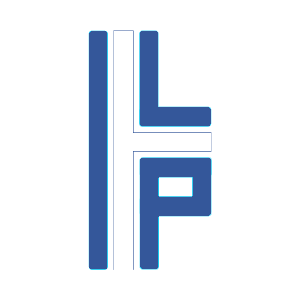
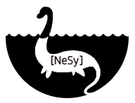
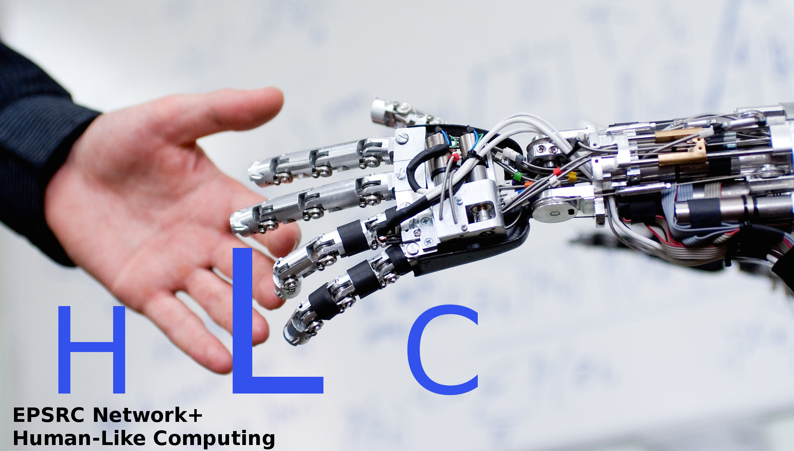

 
<table align="center">
<tr>
  <td>
  
  </td>
  <td>
   
  </td>
  <td>
   
  </td>
  <td>
   
  </td>
</tr>
  <tr>
  <td align="center">
  <a href="https://ijclr22.doc.ic.ac.uk/ilp2022.html">ILP 2022</a>
  </td>
  <td align="center">
  <a href="https://sites.google.com/view/nesy-2022/">NeSy 2022</a> 
  </td>
  <td align="center">
  <a href="">AAIP 2022</a> 
  </td>
  <td align="center">
  <a href="">HLC 2022</a> 
  </td>
  </tr>

</table>
 

## IJCLR 2022  
  
The 2nd International Joint Conference on Learning & Reasoning (IJCLR) will be held in Cumberland Lodge, Windsor Great Park, United Kingdom, 28-30 September 2022.

The rapid progress in machine learning has been the primary reason for a fresh look in the transormative potential of AI as a whole during the past decade. A crucial milestone for taking full advantage of this potential is the endowment of algorithms that learn from experience with the ability to consult existing knowledge and reason with what has already been learned. Integrating learning and reasoning constitutes one of the key open questions in AI, and holds the potential of addressing many of the shortcomings of contemporary AI approaches, including the black-box nature and the brittleness of deep learning, and the difficulty to adapt knowledge representation models in the light of new data. Integrating learning and reasoning calls for approaches that combine knowledge representation and machine reasoning techniques with learning algorithms from the fields of neural, statistical and relational learning.

Four international conferences and workshops addressing such research topics join forces in the 2nd International Conference on Learning & Reasoning (IJCLR 2022):

- The **[31st International Conference on Inductive Logic Programming (ILP)](https://ijclr22.doc.ic.ac.uk/ilp2022.html)**. The ILP conference series has been the premier forum for work on logic-based approaches to learning for three decades. Originally focusing on the induction of logic programs, over the years it has expanded its research horizon to other forms of relational learning and to probabilistic approaches.
- The **[16th International Workshop on Neural-Symbolic Learning & Reasoning (NeSy)](https://sites.google.com/view/nesy-2022/)**. The NeSy workshop series is a major venue for the presentation and discussion of key topics related to neural-symbolic computing, i.e. combinations of neural and logic-based approaches to learning & reasoning.
- The **11th International Workshop on Approaches and Applications of Inductive Programming (AAIP)**. The AAIP workshop series focuses on learning executable programs in arbitrary programming languages, from incomplete specifications. e.g. from examples of their input/output behaviour.
- The **3rd International Workshop on Human-Like Computing (HLC)**. HLC research aims to endow machines with human-like perceptual, reasoning and learning abilities which support collaboration and communication with human beings. The workshop aim is to bring together leading experts in AI and Cognitive Science to investigate areas of fruitful interaction in which human co-operative and communicative skills can be studied and modelled computationally.

IJCLR aims at bringing together researchers and practitioners working on various aspects of learning & reasoning, via presentation of cutting-edge research on topics of special interest to the participating conferences/workshops. In addition to each of the four events' individual programs, which will be held in parallel, IJCLR aims to promote collaboration and cross-fertilization between different approaches and methodologies to integrating learning & reasoning, via joint keynotes, panel discussions and poster sessions.

## Call for Papers

### Journal Track 

IJCLR’s journal track, the special issue on Learning and Reasoning supported by the Machine Learning Journal (MLJ), is accepting paper submissions on regular cut-off dates since February 2020. Submissions are solicited on all aspects of Learning and Reasoning and topics where machine learning is combined with machine reasoning or knowledge representation. Papers are published online by MLJ upon acceptance and authors of accepted papers are invited to present their work at the conference. The upcoming cut-off dates for the journal track are: 1st Feb 2022, 1st May 2022, 1st Aug 2022.

### Conference Track

Each conference/workshop participating in IJCLR will be soliciting paper submissions on the topics of its interest. Accepted papers will be presented at IJCLR. Additionally, IJCLR features a “General Track” where authors are invited to submit work that is relevant to the conference but it does not necessarily fall within the scope of a particular workshop (ILP, NeSy, AAIP, HLC). Submission deadline: TBA

### Recently published papers Track 

IJCLR solicits submissions of high-quality papers on combining learning and reasoning that have been recently published, or accepted for publication, by a first-class conference such as ECML/PKDD, ICML, KDD, ICDM, AAAI, IJCAI, etc., or journal such as MLJ, DMKD, JMLR etc. Papers will be accepted on the grounds of relevance and quality of the original publication venue. Accepted papers will be presented at IJCLR. Submission deadline: TBA

Please follow the Call for Papers link for more information and guidelines on paper submissions to the IJCLR tracks.

## Program
- [Program Outline](program-outline.md)

## Conference venue

[Cumberland Lodge](https://www.cumberlandlodge.ac.uk/), Windsor Great Park, United Kingdom

## Recent Updates

    [15/01/2022] New cut-off dates for the journal track: 1st Feb, 1st May and 1st Aug 2022.
    [01/10/2021] The conference website was launched.

## Important Dates
<table style="text-align: left; width: 100%;" cellspacing="2" cellpadding="2" border="0">
        <tbody>
          <tr>
            <td style="vertical-align: top;">Journal track cut-off dates 
            </td>
            <td style="vertical-align: top;">1st Feb
              2022, 1st May 2022, 1st Aug 2022 </td>
          </tr>
          <tr>
            <td style="vertical-align: top;">Conference abstract
              deadline (ILP) 
            </td>
            <td style="vertical-align: top;">25 May 2022</td>
          </tr>
          <tr>
            <td style="vertical-align: top;">Conference paper deadline 
            </td>
            <td style="vertical-align: top;">31 May 2022 
            </td>
          </tr>
          <tr>
            <td style="vertical-align: top;">Author notification  
            </td>
            <td style="vertical-align: top;">30 July 2022</td>
          </tr>
          <tr>
            <td style="vertical-align: top;">Late-breaking &amp;
              recently published papers  
            </td>
            <td style="vertical-align: top;">TBA</td>
          </tr>
          <tr>
            <td style="vertical-align: top;">Author notification
              (late-breaking) </td>
            <td style="vertical-align: top;">TBA</td>
          </tr>
          <tr>
            <td style="vertical-align: top;">Camera-ready copies due  
            </td>
            <td style="vertical-align: top;">TBA </td>
          </tr>
          <tr>
            <td valign="top">Registration opens 
            </td>
            <td valign="top">TBA 
            </td>
          </tr>
          <tr>
            <td style="vertical-align: top;">IJCLR 2022 Conference 
            </td>
            <td style="vertical-align: top;">28-30 Sep
              2022 
            </td>
          </tr>
        </tbody>
      </table>
      
